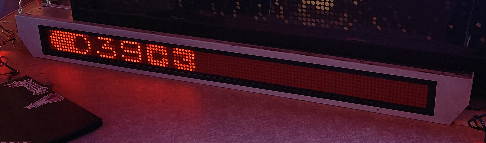
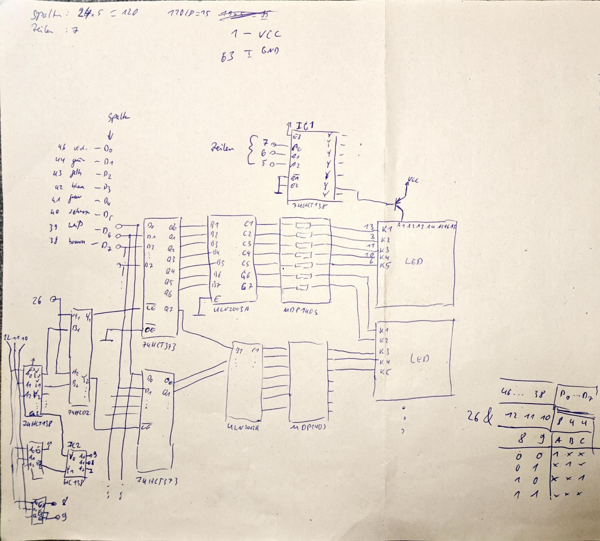
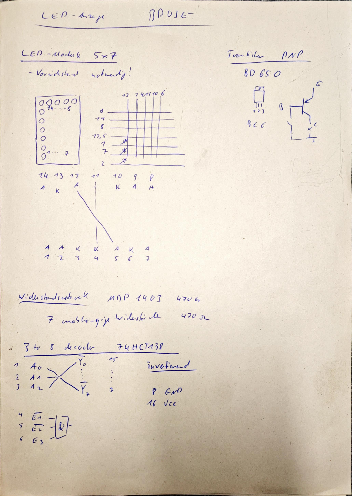
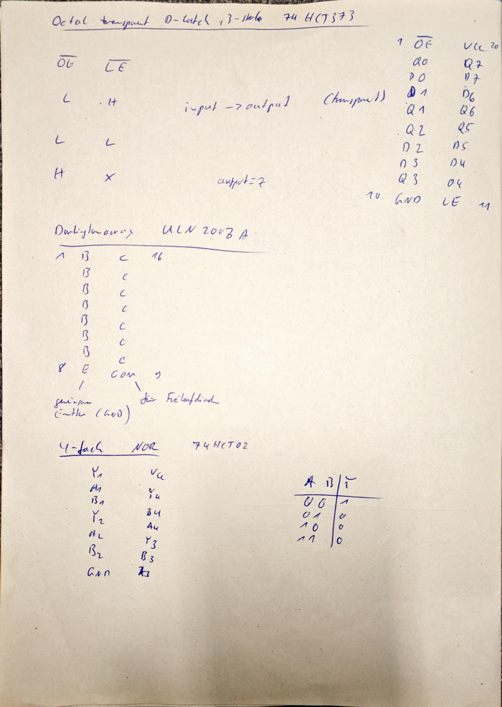

# BoLED
Ansteuerung einer Brose Innenanzeige mit roten LEDs aus ÖPNV-Fahrzeugen

## Schaltung
Die Schaltung der Innenanzeige wurde mithilfe eines Multimesters analysiert und dokumentiert.

Die wichtigsten Informationen zu den ICs wurden den Datenblättern entnommen.

